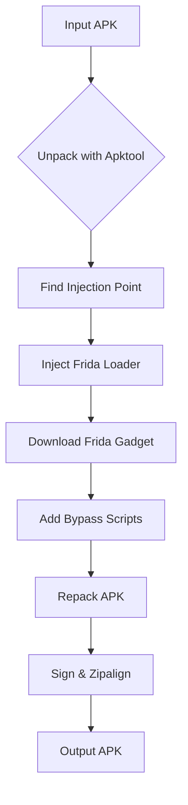

# Instagram SSL Pinning Bypass Tool 🔒➡️🔓

 
 


Automated tool to patch Instagram APK and bypass SSL pinning for security research and penetration testing.

## 🚀 Features

- ⚡ **One-click patching** of Instagram APK
- 🔧 **Automatic injection** of Frida Gadget
- 🛡️ **Multi-layer SSL bypass**:
  - OkHttp Certificate Pinner
  - X509TrustManager
  - Android Network Security Config
  - Native SSL verification
- 📱 **Multi-architecture support**:
  - arm64-v8a
  - armeabi-v7a  
  - x86
  - x86_64
- 🔐 **Auto-signing** with debug keystore
- ⚙️ **Customizable** with advanced options

## 📦 Prerequisites

| Requirement | Installation Guide |
|-------------|--------------------|
| Python 3.6+ | [python.org](https://www.python.org/downloads/) |
| Java JDK | [Oracle JDK](https://www.oracle.com/java/technologies/javase-downloads.html) |
| Android SDK | [Developer Android](https://developer.android.com/studio) |
| Apktool | [Apktool](https://ibotpeaches.github.io/Apktool/) |

```bash
# Install required Python packages
pip install requests
```

## 🛠️ Installation

1. Clone the repository:
```bash
git clone https://github.com/KenXinDev/Unpack-IG-APK.git
cd Unpack-IG-APK
```

2. Make the script executable:
```bash
chmod +x run.py
```

## 💻 Usage

### Basic Usage
```bash
python run.py -i original.apk -o patched.apk
```

### Advanced Options
```bash
python instagram_ssl_bypass.py \
  -i original.apk \
  -o custom_name.apk \
  --keystore my.keystore \
  --keyalias myalias \
  --storepass complexpassword \
  --frida-version 16.1.11
```

### 🔧 Command Line Arguments

| Argument | Description | Default |
|----------|-------------|---------|
| `-i`, `--input` | Input APK path | **Required** |
| `-o`, `--output` | Output APK path | `instagram_patched.apk` |
| `--keystore` | Custom keystore path | Auto-generated |
| `--keyalias` | Keystore alias | `androiddebugkey` |
| `--storepass` | Keystore password | `android` |
| `--frida-version` | Frida gadget version | Latest release |

## 🔍 How It Works



## 🛡️ Included Bypass Techniques

```javascript
// Java Layer Bypasses
Java.perform(function() {
    // OkHttp Bypass
    var CertificatePinner = Java.use("okhttp3.CertificatePinner");
    CertificatePinner.check.overload().implementation = function() {};
    
    // TrustManager Bypass
    var X509TrustManager = Java.use("javax.net.ssl.X509TrustManager");
    X509TrustManager.checkServerTrusted.implementation = function() {};
});

// Native Layer Bypass
Interceptor.attach(Module.findExportByName("libssl.so", "SSL_CTX_set_verify"), {
    onEnter: function(args) { args[2] = ptr(0); }
});
```

## ⚠️ Important Notes

- 🔞 **For educational and research purposes only**
- 📜 Use only on APKs you legally own or have permission to modify
- ⚖️ Comply with all applicable laws and regulations
- 🛑 Not for malicious use

## 🐛 Troubleshooting

| Issue | Solution |
|-------|----------|
| Missing tools | Verify all prerequisites are installed and in PATH |
| Frida download fails | Check internet connection or specify version |
| Injection fails | Try different Instagram version |
| Keystore issues | Provide custom keystore with `--keystore` |

## 📜 License

MIT License - Use responsibly and ethically.

---
**Disclaimer**: This tool is provided for **legal security research** only. The developers assume no liability for any misuse.
